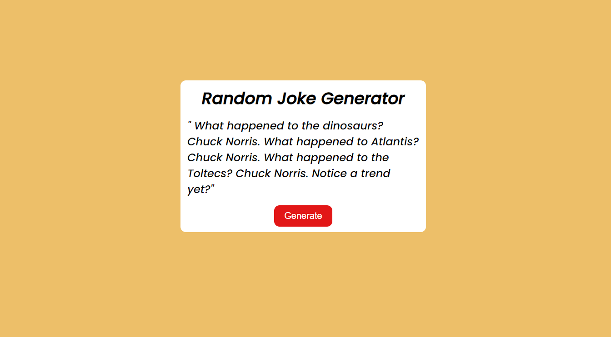

# Random Joke Generator  | JavaScript Project

Hi, I am **Vipransh Verma**

This projet is part of my learning from Full Stack JavaScript developer Bootcamp by Hitesh Sir.

## Learning Experience
It was an amazing experience to learn about  Dom(Document Object Model) manipulation conceps and handling api in JavaScript.

[Live-Link]()

